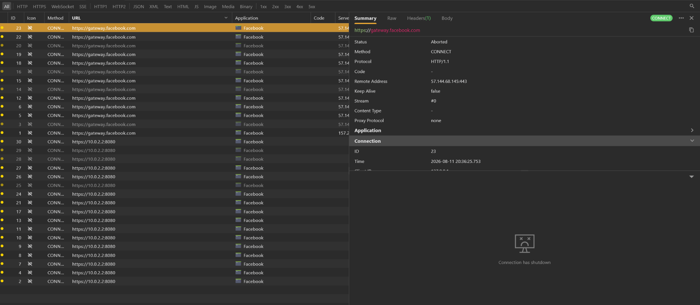
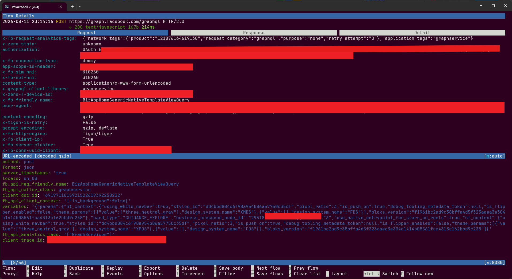
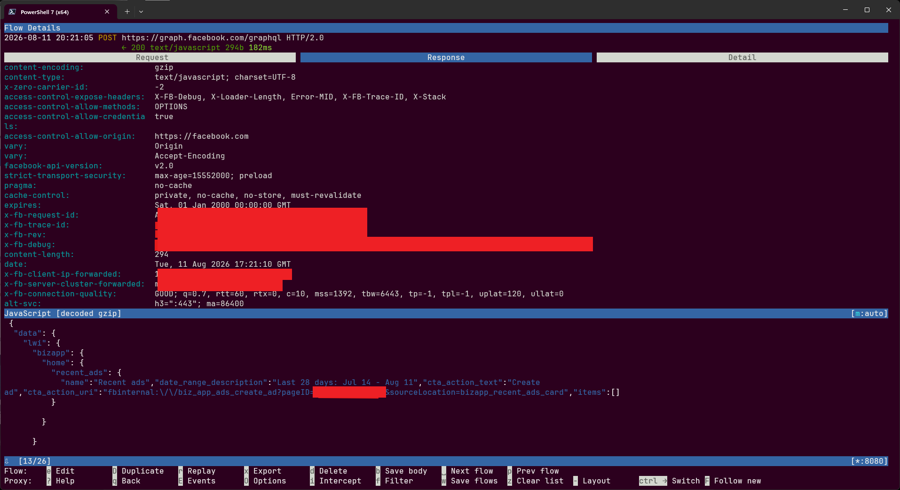

# Meta Android Security Research

Independent mobile application security research by **Waleed Younis**.

I started this project to understand what actually happens between an Android app, its native networking stack, and the traffic that leaves the device. The work focused on selected Meta Android applications, mainly **Meta Business Suite** and **Facebook Lite**, inside a controlled research environment.

The main areas I looked at were:

- TLS and certificate-pinning behavior;
- HTTPS / HTTP2 traffic inspection;
- GraphQL request and response flows;
- native Android networking and the Tigon/Liger path;
- the structure of the `#PWD_ENC:2` password envelope.

This repository is a cleaned record of the research. It is **not** a ready-to-run bypass toolkit, and it does not contain live credentials, session material, private account data, or reusable authentication secrets.

## Evidence

### 1. Before — connection could not be inspected cleanly

The baseline capture shows repeated connections ending before useful application-layer traffic was available.

### 2. After — GraphQL request visible

After working through the TLS / networking path in the test environment, the GraphQL request could be inspected at the application layer. Sensitive values in the screenshot were removed before publication.

### 3. Decoded response

The response was successfully received, decompressed and displayed as application data rather than just an opaque TLS connection.

## What I learned

A few parts of the project were more useful than simply getting traffic on screen:

- following the transition from Java/Android code into native networking code;
- separating certificate-validation behavior from ordinary proxy or CA problems;
- correlating GraphQL requests with their decoded responses;
- recognizing the Tigon/Liger networking path used by the application;
- reconstructing the main pieces of the `#PWD_ENC:2` envelope at a protocol level.

The technical notes are in [`TECHNICAL_NOTES.md`](TECHNICAL_NOTES.md).

## Tools used

Tools used at different stages of the research included **Ghidra, Frida, JADX, mitmproxy, Reqable, Burp Suite, Android debugging tools, and Python**.

## Scope

This was independent research performed on my own test setup for learning and defensive security analysis. Nothing in this repository should be treated as a claim that Meta has a vulnerability simply because a protection or protocol was analyzed.

See [`DISCLAIMER.md`](DISCLAIMER.md) before reusing the material.

---

**Researcher:** Waleed Younis  
**Year:** 2026  
**Status:** Public research notes / sanitized evidence

_Not affiliated with or endorsed by Meta._
